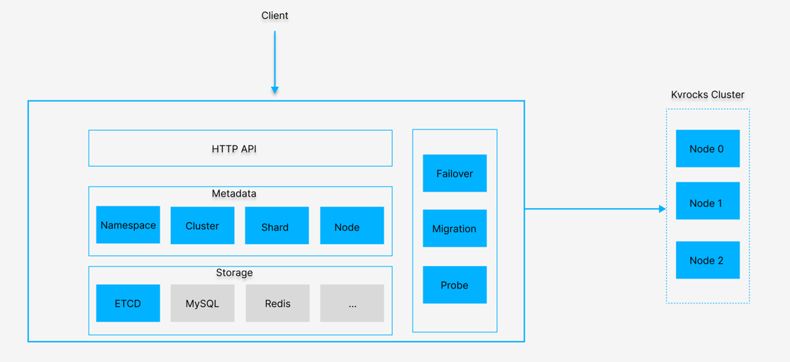
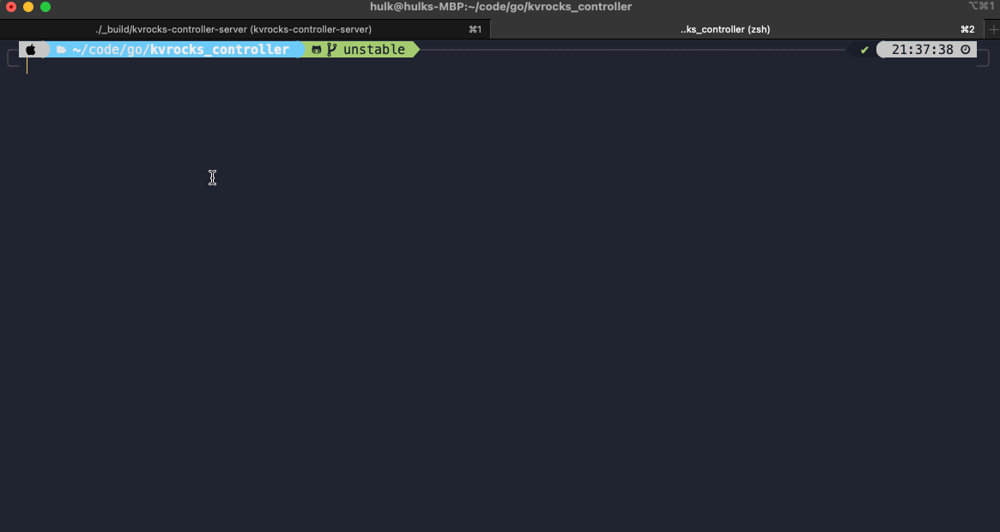

# Kvrocks Cluster Controller

[](https://github.com/RocksLabs/kvrocks_controller/actions) [](https://goreportcard.com/report/github.com/RocksLabs/kvrocks_controller) [](https://codecov.io/gh/KvrocksLabs/kvrocks_controller)

Controller for the [Kvrocks](https://github.com/apache/incubator-kvrocks#---) cluster has the following key features: 

* Failover - controller will failover or remove the master/slave node when probing failed
* Scale out the cluster in one line command
* Manage many clusters in one controller cluster
* Support multi metadata storages like etcd and so on

## Build and Running

### Requirements

* Go >= 1.16
* Nodejs >= 12
### Build binaries 

```shell
$ git clone https://github.com/RocksLabs/kvrocks_controller
$ cd kvrocks_controller
$ make # You can find the binary file in the `_build` dir if all goes good
# ---
# If you do not have a suitable Golang compilation environment locally, you can also use 'make BUILDER_IMAGE=<golang:version>' to choose a Golang image for compilation.
# $make BUILDER_IMAGE=golang:1.20.3
```
### Overview

For the storage, the ETCD is used as the default storage now. Welcome to contribute other storages like MySQL, Redis, Consul and so on. And what you need to do is to implement the [persistence interface](https://github.com/RocksLabs/kvrocks_controller/blob/unstable/storage/persistence/persistence.go).

### 1. Run the controller server 

```shell
# Use docker-compose to setup the etcd
$ make setup
# Run the controller server
$ ./_build/kvctl-server -c config/config.yaml
```


### 2. Create the namespace and cluster via kvctl 



For the HTTP API, you can find the [HTTP API(work in progress)](docs/API.md) for more details.