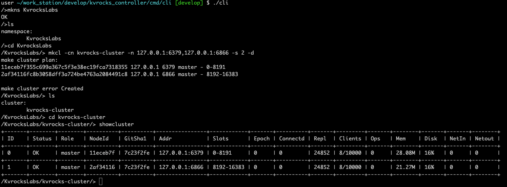
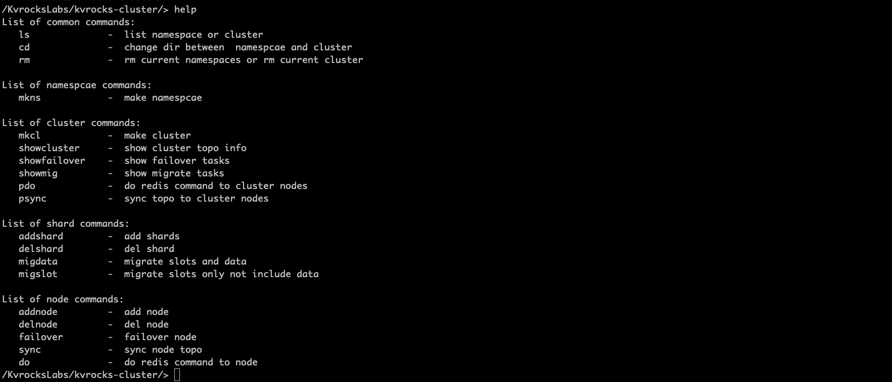
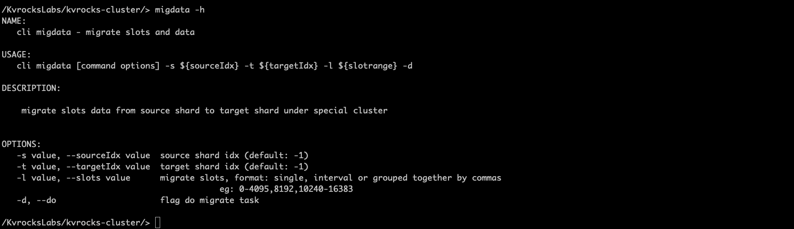
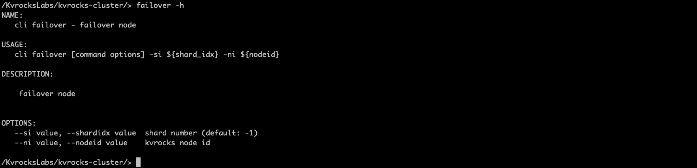

# kvrocks-controller
Kvrocks-controller is [Kvrocks](https://github.com/apache/incubator-kvrocks#---) cluster solution, combine with [Kvrocks](https://github.com/apache/incubator-kvrocks#---) to form a complete distributed kv storage architecture. The design goal of Kvrocks-controller is to ensure high availability of the Kvrocks cluster, common problems in clusters can be handled automatically, avoiding more manual intervention. Kvrocks-controller use etcd store cluster metadata, and leader election.

## Features

* Aotu Failover, probe Kvrocks cluster nodes healthy, if node fail will failover it.
* Aotu expand and reduce cluster capacity and size, a simple command line start expand or reduce.
* Support namsespaces notion, deploy one kvrocks_controller instance manage multiple namsespaces and clusters.
* Powerful, easy-to-use command line tool, greatly reduce devops works and ensure high availability of the cluster.

## Build and Running

### Requirements

* go 1.16
* deploy etc cluster

### Build kvrocks_controller

```shell
git clone https://github.com/Kvrock
cd ./kvrocks_controller/cmd/kvrocks-controller/
go build
```

### Running kvrocks_controller

```
./kvrocks_controller -c ./config.yaml
```

#### config.yaml

```
controller: 127.0.0.1:9159  // current kvrocks_controller address
etcdhosts:                  // etcd cluster address
 - 127.0.0.1:2379
 - 127.0.0.1:3379
 - 127.0.0.1:4379
```

### Build Cli

```
git clone https://github.com/Kvrock
cd ./kvrocks_controller/cmd/cli/
go build
```

### Running cli

```
./cli
```

### cli config file

> Notice: cli config path is '~/.kc_cli_config' is fixed

#### ~/.kc_cli_config

```
controllers:       // kvrocks-controller address
 - 127.0.0.1:9159
 - 127.0.0.1:9379
```


## Usage Cli

* make namespace and cluster

  ```
  mkns ${namespace} // create namespace
  mkcl -cn ${clustername} -s ${shard_number} -n ${nodeaddr1,nodeaddr2...}/-c ${configpath} -d ${do}
  showcluster // show cluster info
  ```

  

* Help

  help command show all command usage info

   

## Migrate



> Notice: migdata comman migrate slot and data, migslot only migrate slot exclude data

## Failover




