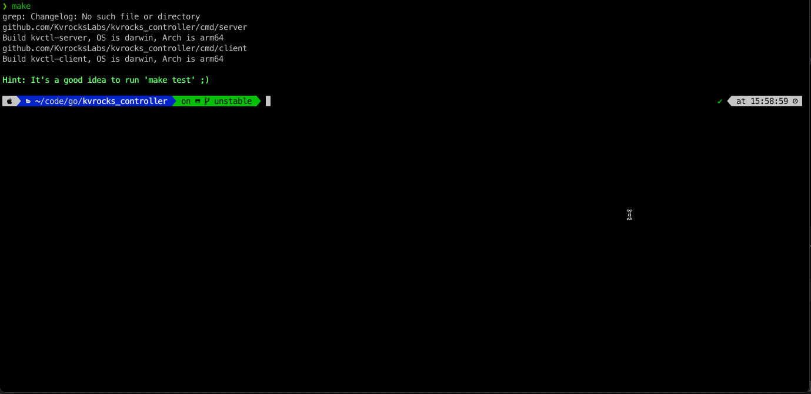

# Kvrocks Cluster Controller

[](https://github.com/KvrocksLabs/kvrocks_controller/actions) [](https://goreportcard.com/report/github.com/KvrocksLabs/kvrocks_controller) [](https://codecov.io/gh/KvrocksLabs/kvrocks_controller)

Controller for the [Kvrocks](https://github.com/apache/incubator-kvrocks#---) cluster has the following key features: 

* Failover - controller will failover or remove the master/slave node when probing failed
* Scale out the cluster in one line command
* Manage many clusters in one controller cluster
* Support multi metadata storages like etcd and so on

## Build and Running

### Requirements

* Go >= 1.16

### Build binaries 

```shell
$ git clone https://github.com/KvrocksLabs/kvrocks_controller
$ cd kvrocks_controller
$ make # You can find the binary file in the `_build` dir if all goes good
```

### 1. Run the controller server 

```shell
# Use docker-compose to setup the etcd
$ make setup
# Run the controller server
$ ./_build/kvrocks-controller-server -c config/config.yaml
```


### 2. Create the namespace and cluster via API

```shell
# create namespace
$ curl -XPOST -d '{"namespace":"test-ns"}'  -i "http://127.0.0.1:9380/api/v1/namespaces"
# create cluster
$ curl -XPOST -d '{"name":"test-cluster", "nodes":["127.0.0.1:6666","127.0.0.1:6667"], "replicas":2}'  -i "http://127.0.0.1:9380/api/v1/namespaces/test-ns/clusters"
```

