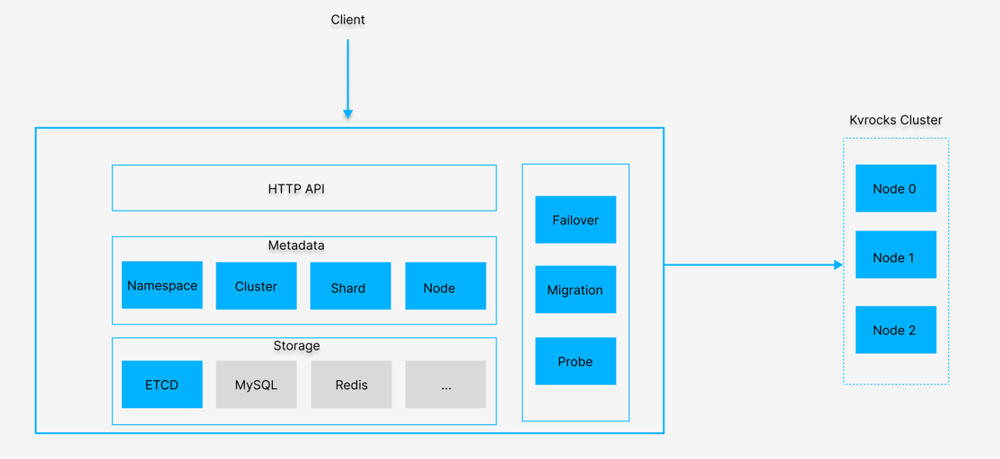
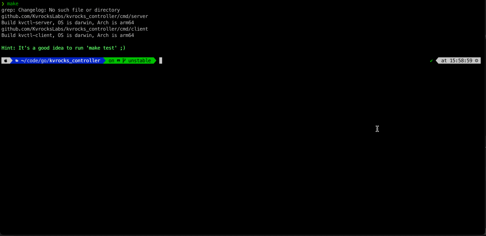

# Apache Kvrocks Controller

[](https://github.com/apache/kvrocks-controller/actions) [](https://goreportcard.com/report/github.com/apache/kvrocks-controller) [](https://codecov.io/gh/apache/kvrocks-controller)

Apache Kvrocks Controller is a cluster management tool for [Apache Kvrocks](https://github.com/apache/incubator-kvrocks), including the following key features:

* Failover - controller will failover or remove the master/slave node when probing failed
* Scale out the cluster in one line command
* Manage many clusters in one controller cluster
* Support multi metadata storages like etcd and so on

## Building and Running

### Build binaries

```shell
$ git clone https://github.com/apache/kvrocks-controller
$ cd kvrocks-controller
$ make # You can find the binary file in the `_build` dir if all goes good
```

### Overview

For the storage, the ETCD is used as the default storage now. Welcome to contribute other storages like MySQL, Redis, Consul and so on. And what you need to do is to implement the [Engine interface](https://github.com/apache/kvrocks-controller/blob/unstable/store/engine/engine.go).

### Supported Storage Engine
- ETCD
- Zookeeper
- Consul by HashiCorp
- Embedded Raft storage (experimental)

### Run the controller server

```shell
# Use docker-compose to setup the etcd or zookeeper
$ make setup
# Run the controller server
$ ./_build/kvctl-server -c config/config.yaml
```

### Run the controller server in Docker

```shell
$ docker run -it -p 9379:9379 apache/kvrocks-controller:latest
```



### Run server with the embedded Raft engine

> Note: The embedded Raft engine is still in the experimental stage, and it's not recommended to use it in the production environment.

Change the storage type to `raft` in the configuration file.

```yaml
storage_type: raft

raft:
  id: 1
  data_dir: "/data/kvrocks/raft/1"
  cluster_state: "new"
  peers:
    - "http://127.0.0.1:6001"
    - "http://127.0.0.1:6002"
    - "http://127.0.0.1:6003"
```

- `id`: the id for the raft node, it's also an index in the `peers` list
- `data_dir`: the directory to store the raft data
- `cluster_state`: the state of the raft cluster, it should be `new` when the cluster is initialized. And it should be `existing` when the cluster is already bootstrapped.
- `peers`: the list of the raft peers, it should include all the nodes in the cluster.

And then you can run the controller server with the configuration file.

```shell
$ ./_build/kvctl-server -c config/config-raft.yaml
```

#### Add/Remove a raft peer node

We now support adding and removing via the HTTP API.

```shell
# Add a new peer node
curl -XPOST -d '{"id":4,"peer":"http://127.0.0.1:6004","operation":"add"}'  http://127.0.0.1:9379/api/v1/raft/peers

# Remove a peer node
curl -XPOST -d '{"id":4, "operation":"remove"}'  http://127.0.0.1:9379/api/v1/raft/peers

# List all the peer nodes
curl http://127.0.0.1:9379/api/v1/raft/peers
```

### Use client to interact with the controller server

```shell
# Show help
$ ./_build/kvctl --help

# Create namespace
$ ./_build/kvctl create namespace test-ns

# List namespaces
$ ./_build/kvctl list namespaces

# Create cluster in the namespace
$ ./_build/kvctl create cluster test-cluster --nodes 127.0.0.1:6666,127.0.0.1:6667 -n test-ns

# List clusters in the namespace
$ ./_build/kvctl list clusters -n test-ns

# Get cluster in the namespace
$ ./_build/kvctl get cluster test-cluster -n test-ns

# Migrate slot from source to target
$ ./_build/kvctl migrate slot 123 --target 1 -n test-ns -c test-cluster
```

For the HTTP API, you can find the [HTTP API(work in progress)](docs/API.md) for more details.

## Documentation

At the moment, there is no dedicated documentation page specifically for the Kvrocks Controller.
Most information is currently available in the source code and in the main Kvrocks documentation.

To help new contributors and users, here are the useful resources:

- Official Kvrocks Documentation:  
  https://kvrocks.apache.org/

- [Node Operations Guide](docs/NODE_OPERATIONS.md) - Comprehensive guide for managing nodes, including workflows for handling IP address changes

- [HTTP API Reference](docs/API.md) - Complete HTTP API documentation

- Configuration examples for the controller can be found inside the `config/` directory.

- API usage examples are provided in this README and in the source files under the `controller/` directory.

More structured and detailed documentation for the Kvrocks Controller will be added in the future.
Contributions to improve the documentation are always welcome.

## License

Licensed under the [Apache License, Version 2.0](LICENSE)
